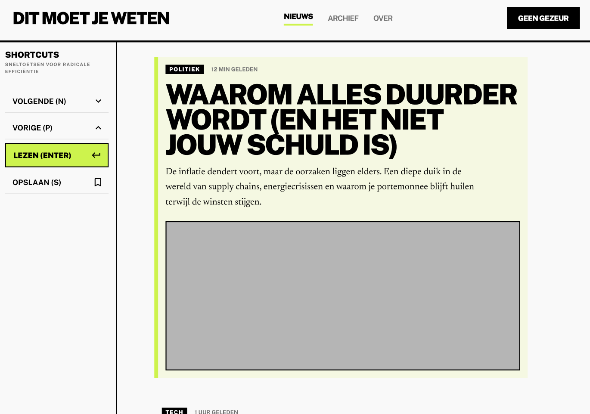
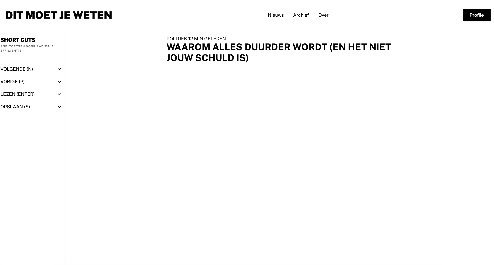

# HCD-opdracht
**inleiding**
Voor deze opdracht ontwerp ik een prototype voor Berend die blind is en die door het internet navigeerd met een screenreader. Het doel is om een oplossing te maken die volledig gebaseerd is op zijn persoonlijke manier van werken.

Ik onderzoek hoe Berend op websites navigeert en waar hij tegenaan loopt, bijvoorbeeld bij het gebruik van sneltoetsen en het vinden van informatie. Op basis daarvan ontwerp ik een web-app die hem helpt om beter en prettiger te navigeren, zoals het aanpassen van de focus op een pagina of het maken van sneltoetsen. Bij het ontwerpen volg ik de exclusive design principles.

## Week 1/1
**Wat heb ik gedaan?**
Ik heb vandaag de opdracht voor HCD doorgenomen. Ik heb gekozen voor Voorkeuren waarbij ik mij ga focussen op de focus, screenreader, sneltoetsen en andere toegankelijkheids problemen. Ik heb er voor gekozen om een nieuws website te maken waarbij het volledig is afgesteld op de persoonlijke behoeftes van Berend.

Ik heb een figma design gemaakt en ben gestart met een begin ervan te coderen.

**Figma Design**
 

**Code Design**

**Hoe lang duurde het?**
Ik ben een uur bezig geweest met het maken van de design: **1 uur**

Ik ben 2 uurtjes bezig geweest met het maken van een begin in visual studio code: **2 uur**

**Wat heb ik geleerd?**
Ik heb geleerd dat de screenreader bij een datepicker een percentage voorleest als je geen default datum geeft zoals in safari. (Credit Jelle)

Ik heb kennis gemaakt met de time element van html

**Wat ga ik morgen doen?**
Morgen ga ik de eerste test uitvoeren met berend en daar aantekeningen van maken. Zo kan alvast een begin maken met personaliseren van mijn web-app op zijn persoonlijke behoefte. 

Weekly Geek 1

Study situation  
In plaats van alles oppervlakkig te proberen begrijpen, focus je op één specifieke gebruiker of situatie om echte, diepgaande inzichten te krijgen.

 Ignore conventions
Veel bestaande UX-patronen werken niet voor iedereen. Durf conventies los te laten als ze niet aansluiten bij bepaalde gebruikers (bijv. screenreader-gebruikers).

Prioritise identity
Niet alleen content is belangrijk — ook de identiteit en beleving van gebruikers. Betrek mensen met beperkingen actief als co-designers.

Add nonsense 
Omdat we nog niet alles weten, kan het helpen om onlogische ideeën te verkennen. Dit kan leiden tot onverwachte en waardevolle oplossingen.

## Week 1/2

**Testplan**
Het doel van deze test is niet om een afgerond prototype te evalueren, maar om inzichten te verkrijgen in hoe Berend het web gebruikt.

Ik wil begrijpen:
* hoe hij navigeert (toetsenbord / screenreader)
* wat hij irritant vindt aan websites (vooral nieuwssites)
* welke patronen en sneltoetsen hij gebruikt
* wat voor hem een prettige ervaring is

**Vragen**
* Hoe gebruik jij meestal het internet?
* Gebruik je een screenreader of vooral toetsenbord?
* Lees je wel eens nieuws? Welke sites?
* Wat vind je irritant aan die sites?
* Hoe navigeer je meestal door een pagina?
* Gebruik je bepaalde toetsen vaak?
* Wat werkt bijna altijd slecht op websites?

**Mijn Prototype**
Opdracht 1
Dit is een eerste idee. Wat denk je dat je hier kunt doen?

Opdracht 2
Wat zou jij hier willen doen?

Opdracht 3
Wat mist er voor jou?

**Concept Vragen**
* Zou je willen dat een site meteen bij de content begint?
* Wat zou je altijd willen overslaan op een website?
* Wat zou een perfecte nieuwssite voor jou doen?

**Bevindingen Test**
gebruikt spraak software die heel snel voorleest.
grote groene border om door de pagina heen heen te gaan.

feedback nienke:
spraak en opname 1 knop maken
feedback geven bij bepaalde acties zoals: je bent nu aan het opnemen.
je kan knoppen weghalen bij een audio slider zoals de mute button anders zijn het extra knoppen waar ik door moet.

uitgebeide beschrijving 
niet alle buttons achter elkaar laten oplezen maar tussen stapjes 

nvda creenreader

meer feedback is beter 

kijk naar de snel toetsen die nog vrij zijn bij nvda 

verdergaan na dat je een startpositie hebt gekozen. dus niet weer helemaal boven aan beginnen.

laptop telefoon gebruikt hij

spraakberichten in signal en whatsapp gebruikt hij spraak
gebruikt meer typen dan spraak berichten.

gebruikt 6 knoppen om te typen. brial 

met steekwoorden in een spraak bericht kunnen zoeken.

een bookmark systeem waarbij je artikelen kan opslaan die je later weer kan opzoeken. Je komt op at5 en je selecteerd een artikeld. je kan dan die artikel opslaan en dan via een menu later weer opzoeken.

berend@berendconnect.nl

**Wat heb ik gedaan?**

**Hoe lang duurde het?**

**Wat heb ik geleerd?**

**Wat ga ik volgende week doen?**

## Week 2/1

## Week 2/2

## Week 3/1

## Week 3/2

